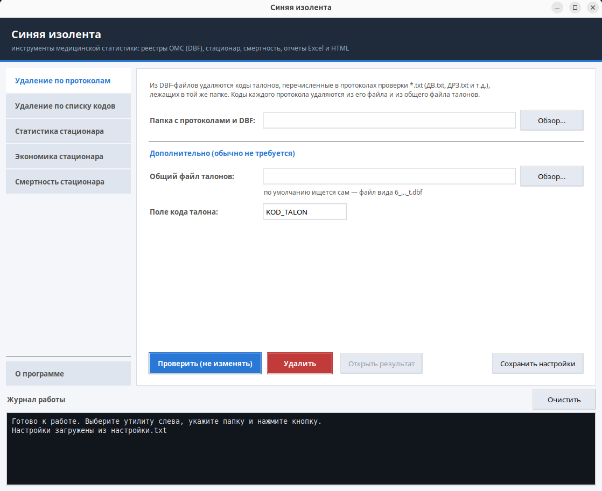
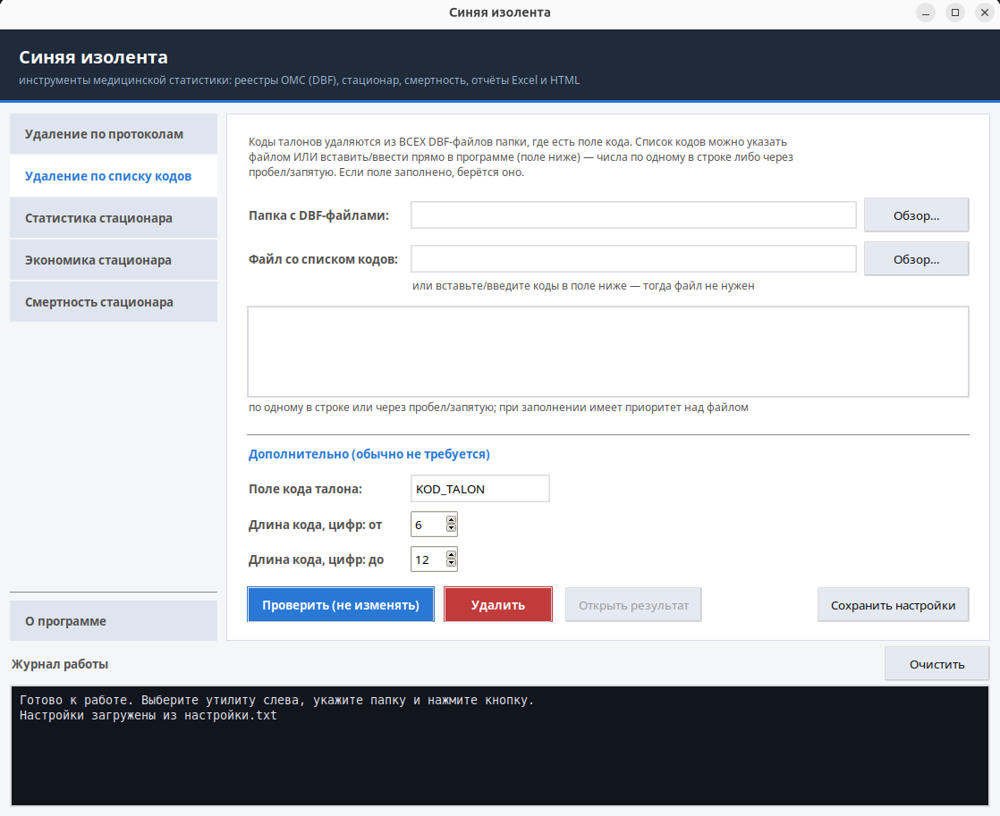
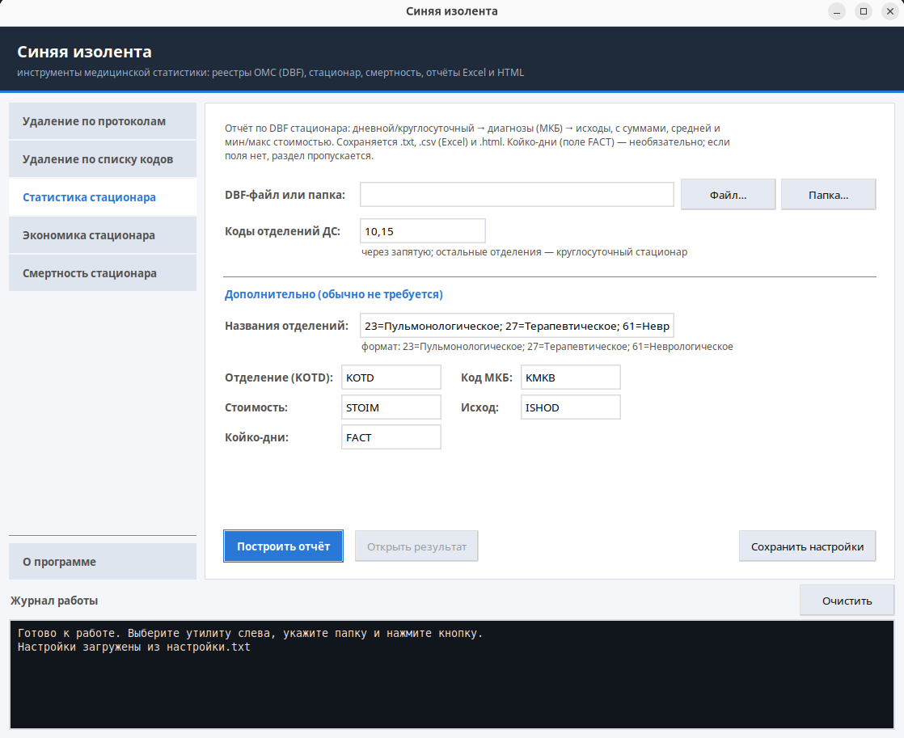
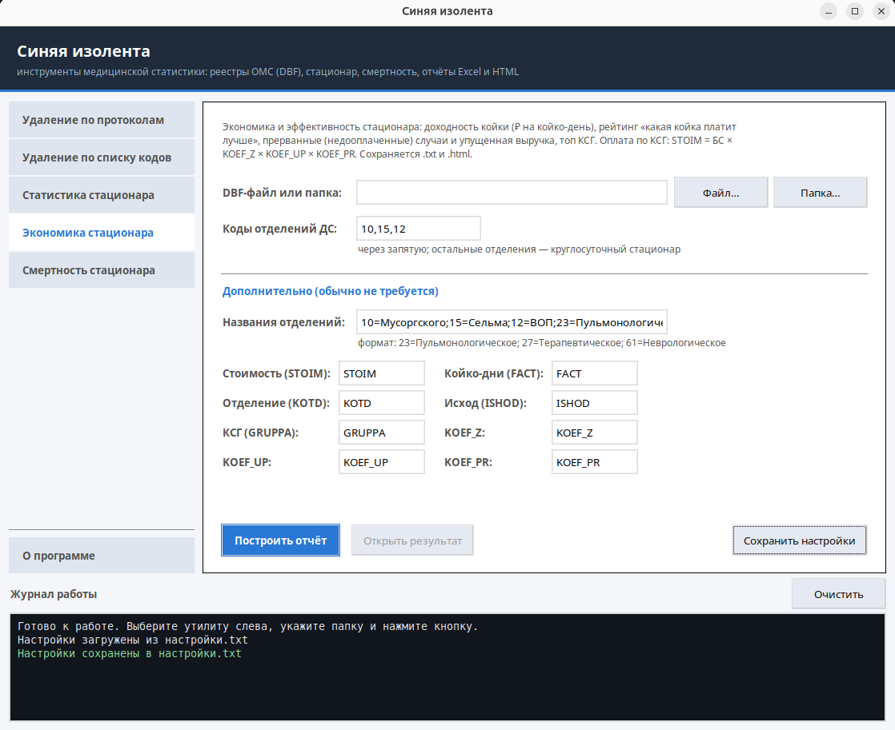

# duct-tape — обработка DBF-реестров ОМС

Набор утилит для работы с DBF-реестрами обязательного медицинского страхования
под единым графическим интерфейсом. Проект — платформа: новые утилиты добавляются
одним файлом-плагином и автоматически получают вкладку, сохранение настроек и общий
журнал работы.

Написан на чистой стандартной библиотеке Python — **сторонних зависимостей нет**
(графика — на `tkinter`, который поставляется вместе с Python).

📄 [История изменений (CHANGELOG)](CHANGELOG.md) · ⬇️ [Релизы и готовый `.exe`](https://github.com/Mist3s/duct-tape/releases)

## Возможности

| Утилита | Что делает |
|---------|------------|
| **Удаление по протоколам** | Удаляет из DBF коды талонов, перечисленные в протоколах проверки `*.txt`, — из файла протокола и из общего файла талонов. |
| **Удаление по списку кодов** | Удаляет записи с кодами талонов из простого текстового списка — из всех DBF папки, где есть поле кода. |
| **Статистика стационара** | Строит отчёт по DBF стационара (дневной/круглосуточный → диагнозы МКБ → исходы) и сохраняет `.txt`, `.csv` (для Excel) и наглядный `.html`. |
| **Экономика стационара** | Разбирает оплату по КСГ (`STOIM = БС × KOEF_Z × KOEF_UP × KOEF_PR`): доходность койки (₽ на койко-день), рейтинг «какая койка платит лучше», прерванные (недооплаченные) случаи и упущенная выручка, влияние исходов. Группы КСГ подписаны официальными наименованиями и профилями из встроенного [справочника КСГ](#справочник-ксг-наименования-групп). Отдельно по дневному и круглосуточному стационару. Сохраняет `.txt` и `.html`. |
| **Смертность стационара** | Строит отчёт «Смертность» из выгрузки «Отчёт по умершим» (файл `.xls`/`.html`): раскладывает умерших по месяцам и группам причин смерти (класс МКБ), как ручной отчёт `СМЕРТНОСТЬ … СТАЦИОНАР`. Группа определяется по коду МКБ через [справочник МКБ→группа](#справочник-причин-смерти-мкбгруппа). Сохраняет `.xlsx` (Excel, как образец — с ширинами колонок и жирной шапкой), `.html` и `.txt`. |

## Скриншоты

| Удаление по протоколам | Удаление по списку кодов |
|:---:|:---:|
|  |  |
| **Статистика стационара** | **Экономика стационара** |
|  |  |

Общие свойства обеих утилит удаления:

- **Режим проверки** («Проверить, не изменять» / `--dry-run`) — показывает, что будет удалено, ничего не трогая.
- **Резервная копия** всего семейства файлов (`.dbf` + мемо `.fpt/.dbt` + индексы `.cdx/.idx`) в папку `backup_<дата_время>` перед любым изменением.
- **Атомарная запись** (через временный файл): исходный файл не остаётся повреждённым при сбое.
- **Обновление индексов**: после физического удаления устаревшие индексы `.cdx/.idx` удаляются, а флаг индекса в заголовке сбрасывается — потребитель (FoxPro) перестроит их заново.
- **Самопроверка** после записи и подробный журнал (в т.ч. в файл `udalenie_*.log`).

## Установка

Нужен Python 3.9 или новее.

```bash
git clone https://github.com/Mist3s/duct-tape.git
cd duct-tape
pip install -e .
```

## Запуск

Графический интерфейс:

```bash
omsreg            # после установки пакета
# или без установки, из папки проекта:
python -m omsreg
```

В Windows можно запустить `scripts\run-gui.bat`, в Linux/macOS — `scripts/run-gui.sh`.

## Командная строка

Все утилиты доступны и из терминала — как через единую команду `omsreg`, так и по отдельности:

```bash
omsreg remove-talons re_gb3 --dry-run
omsreg remove-codes  re_gb3 коды.txt
omsreg stat          uu/0091_016.dbf --day-kotd 10,15,12
omsreg econ          uu/0091_016.dbf --day-kotd 10,15,12
omsreg deaths        "Отчет по умершим (новый).xls"

# отдельные команды (устанавливаются вместе с пакетом):
omsreg-remove-talons ...
omsreg-remove-codes  ...
omsreg-stat          ...
omsreg-econ          ...
omsreg-deaths        ...
```

Подробнее по каждой — `omsreg <команда> --help`.

## Сборка в EXE (Windows)

```bat
scripts\build-exe.bat
```

Получится один файл `dist\duct-tape.exe`, который работает без установленного Python.
На каждый тег `v*` тот же EXE собирается автоматически в GitHub Actions
(`.github/workflows/build-exe.yml`).

## Настройки

Значения полей сохраняются в файле `настройки.txt` рядом с программой (создаётся при
первом запуске). В репозитории лежит только пример — [`examples/настройки.example.txt`](examples/настройки.example.txt);
сам `настройки.txt` намеренно не версионируется. Файлы прежней версии со старыми
русскими ключами подхватываются автоматически и переписываются в новую схему.

## Справочник КСГ (наименования групп)

Отчёт «Экономика стационара» подписывает группы КСГ официальными наименованиями и
профилями из справочника [`src/omsreg/utils/_shared/ksg_catalog.py`](src/omsreg/utils/_shared/ksg_catalog.py)
(692 группы: дневной `ds…` + круглосуточный `st…`). Веса и коэффициенты в справочник
намеренно не входят — они берутся из самого реестра.

Справочник **сгенерирован** и вручную не правится. Пересобрать его при выходе новой
версии (например, на новый год) — из официальных файлов «Расшифровка групп КСГ … .xlsx»
скриптом [`tools/build_ksg_catalog.py`](tools/build_ksg_catalog.py):

```bash
python tools/build_ksg_catalog.py \
    "Расшифровка групп КСГ для дневного стационара на 2026 год.xlsx" \
    "Расшифровка групп КСГ для круглосуточного стационара на 2026 год.xlsx"
```

Скрипт читает лист «КСГ» каждого файла (столбцы «КСГ», «Наименование КСГ», «Профиль»),
объединяет дневной и круглосуточный стационар в один словарь и перезаписывает
`ksg_catalog.py`. Зависимостей нет — `.xlsx` разбирается как zip с XML средствами
стандартной библиотеки. Необязательный ключ `--out PATH` меняет путь вывода.

## Справочник причин смерти (МКБ→группа)

Отчёт «Смертность стационара» относит каждого умершего к группе причин смерти по коду
МКБ клинического диагноза (патологоанатомический — если клинический пуст) через
справочник [`src/omsreg/utils/_shared/mkb_death_groups.csv`](src/omsreg/utils/_shared/mkb_death_groups.csv).
Это простой редактируемый CSV: правила `код_от;код_до;группа;подгруппа` читаются
сверху вниз, берётся первое подходящее (специфичные — выше общих). Пример:

```
G00;G99;Болезни нервной системы;
I60;I69;Болезни нервной системы;      # инсульты отнесены к неврологии, а не к кровообращению
I20;I25;Болезни кровообращения;ИБС    # подгруппа -> приписка «(в т.ч. ИБС N)»
I48;I48;Болезни кровообращения;фибрилляция
I00;I99;Болезни кровообращения;
```

Порядок столбцов в отчёте = порядок первого появления групп в файле; коды вне всех
правил идут в столбец «Прочие» (их список выводится в отчёте, чтобы можно было
дополнить справочник). Правьте файл под свой перечень групп; для `.exe` можно указать
свой CSV того же формата — параметром «Справочник групп» на вкладке или ключом
`--groups` в командной строке (без пересборки программы).

Excel-файл отчёта (`.xlsx`) собирается мини-генератором
[`core/xlsx.py`](src/omsreg/core/xlsx.py) на стандартной библиотеке (ширины колонок,
жирная шапка, рамки — как в образце), поэтому сторонних зависимостей по-прежнему нет.

## Структура проекта

```
src/omsreg/
  core/     общий код без tkinter: dbf, convert, format, errors, logging_setup, cli,
            backup, textio, report_html, xlsx (мини-генератор .xlsx)
  utils/    доменные утилиты-вкладки (CLI + функции run_*): remove_error_talons,
            remove_codes, stat_stacionar, stat_economics, stat_deaths
    _shared/  вспомогательное (не вкладки): stat_common, removal_common,
              stat_stacionar_report, stat_economics_report, stat_deaths_report,
              ksg_catalog (справочник КСГ), mkb_death_groups (+ .csv — справочник причин смерти)
  gui/      платформа: spec, registry, theme, config, log_panel, app, plugins/
tests/      тесты ядра и утилит (без дисплея)
tools/      сервисные скрипты (в пакет не входят): build_ksg_catalog.py —
            сборка справочника КСГ из официальных xlsx
```

## Добавление новой утилиты

1. Напишите доменную логику в `src/omsreg/utils/<name>.py` (функция `run_...`, при
   желании `main()` для CLI). Всё чтение/запись DBF берите из `omsreg.core`.
2. Создайте плагин `src/omsreg/gui/plugins/<name>.py` с объектом `SPEC`
   (`omsreg.gui.spec.UtilitySpec`): метаданные, схема параметров, кнопки-действия и
   функция `run(ctx) -> JobResult`. См. готовые `plugins/stat.py`, `plugins/codes.py`.
3. Добавьте модуль в кортеж `BUILTIN` в `plugins/__init__.py` — это обязательно,
   чтобы плагин попал в сборку `.exe` (в собранном приложении файлового автоскана
   нет). При запуске из исходников плагин подхватится и без этого шага.

Вкладка, хранение настроек и поток запуск/проверка/подтверждение/журнал
создадутся автоматически.

## Разработка

```bash
pip install -e .[dev]
ruff check .
pytest -q
```

## Лицензия

[MIT](LICENSE).
